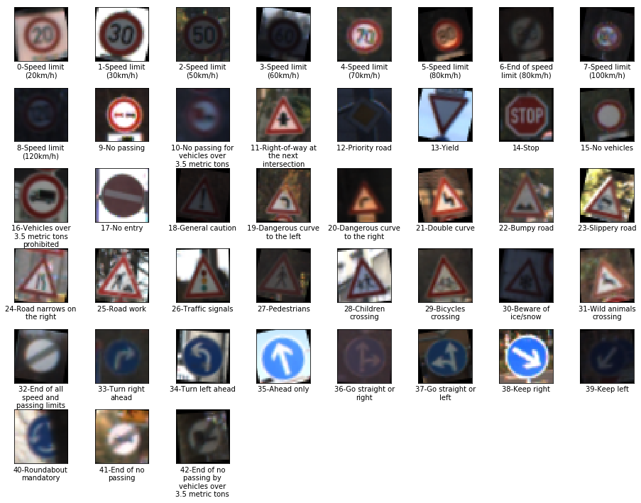
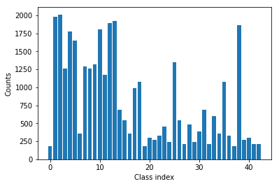
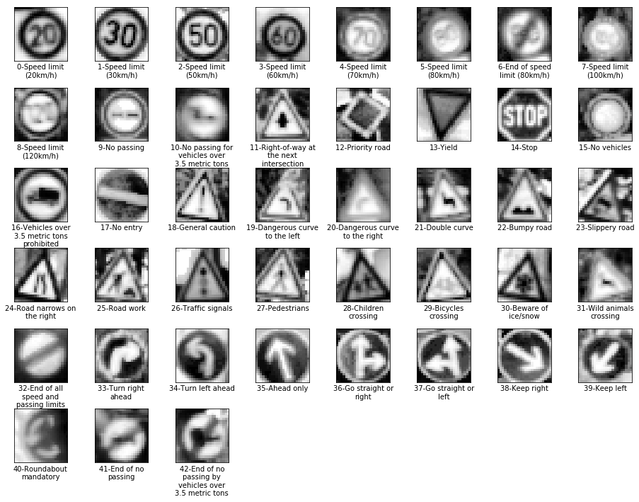
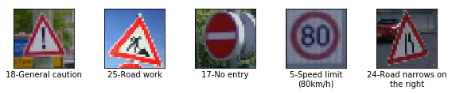
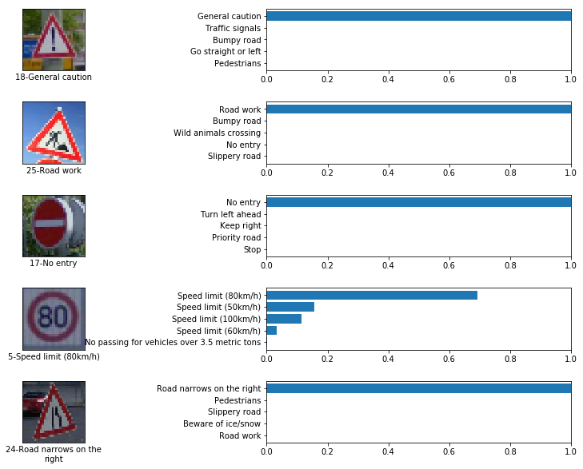
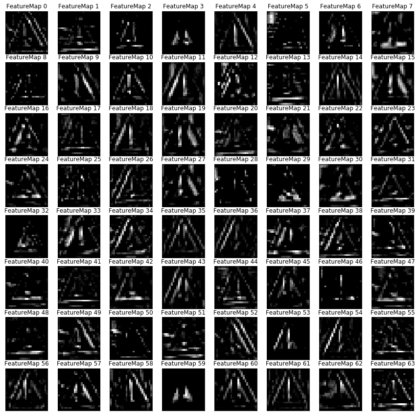

# Traffic Sign Recognition

---

**Build a Traffic Sign Recognition Project**

The goals / steps of this project are the following:
* Load the data set (see below for links to the project data set)
* Explore, summarize and visualize the data set
* Design, train and test a model architecture
* Use the model to make predictions on new images
* Analyze the softmax probabilities of the new images
* Summarize the results with a written report

[//]: # (Image References)

[image1]: ./examples/visualization.jpg "Visualization"
[image2]: ./examples/grayscale.jpg "Grayscaling"
[image3]: ./examples/random_noise.jpg "Random Noise"
[image4]: ./examples/placeholder.png "Traffic Sign 1"
[image5]: ./examples/placeholder.png "Traffic Sign 2"
[image6]: ./examples/placeholder.png "Traffic Sign 3"
[image7]: ./examples/placeholder.png "Traffic Sign 4"
[image8]: ./examples/placeholder.png "Traffic Sign 5"

## Rubric Points
### Here I will consider the [rubric points](https://review.udacity.com/#!/rubrics/481/view) individually and describe how I addressed each point in my implementation.  

### Data Set Summary & Exploration

#### 1. Provide a basic summary of the data set. In the code, the analysis should be done using python, numpy and/or pandas methods rather than hardcoding results manually.

I used the numpy library to calculate summary statistics of the traffic
signs data set:

* The size of training set is 34799
* The size of the validation set is 4410
* The size of test set is 12630
* The shape of a traffic sign image is (32, 32, 3)
* The number of unique classes/labels in the data set is 43

#### 2. Include an exploratory visualization of the dataset.

Here is an exploratory visualization of the data set. I plot one randomly sampled images for each class from the training dataset with corresponding labels (in the format of *label_id-sign_name*). **Notice that this training dataset is after augmentation, where I rotated, shifted, and scaled some of the original images.**

Below is a bar chart showing the distribution of the original training data. We can tell that some classes have far fewer training images than other classes. This make it difficult to predict the classes with small number of training images. Therefore, I augmented the original training data set with randomly rotated, shifted and scaled images such that every class has 4000 images.

### Design and Test a Model Architecture

#### 1. Describe how you preprocessed the image data. What techniques were chosen and why did you choose these techniques? Consider including images showing the output of each preprocessing technique. Pre-processing refers to techniques such as converting to grayscale, normalization, etc. (OPTIONAL: As described in the "Stand Out Suggestions" part of the rubric, if you generated additional data for training, describe why you decided to generate additional data, how you generated the data, and provide example images of the additional data. Then describe the characteristics of the augmented training set like number of images in the set, number of images for each class, etc.)

- As a first step, I decided to convert the images to grayscale because the color information on the traffic signs seems not as important as the shape of the signs, and reducing dimensions make the training a lot faster.
- Then, I cropped the image from 32x32 to 24x24. Getting rid of the borders make the training focus on the real content, the signs. It also increase the training speed.
- Then, I did a histogram equalization for each image using openCV function `cv2.equalizeHist(image)` to increase the contrast because it seems a lot of the images were taken with very low exposure.
- Then, I converted the image into floating point representation.
- Finally, I applied normalization to every image in the dataset such that each image has zero mean and unit variance. The `adjusted_std` variable is borrowed from tensorflow implementation of the `tf.image.per_image_standardization` to avoid the case of uniform images.

The resulting processed images (same as above) are shown as below.

#### 2. Describe what your final model architecture looks like including model type, layers, layer sizes, connectivity, etc.) Consider including a diagram and/or table describing the final model.

My final model consisted of the following layers:

| Layer | Description |
|:---------------------:|:---------------------------------------------:|
| Input | 24x24x1 gray scale image |
| Convolution 5x5 | 1x1 stride, same padding, outputs 24x24x64 	|
| RELU | |
| Max pooling | 2x2 stride, outputs 12x12x64 |
| Convolution 5x5 | 1x1 stride, same padding, outputs 12x12x64 |
| RELU | |
| Max pooling | 2x2 stride, outputs 6x6x64 |
| Fully connected | inputs flattened 6x6x64=4096, outputs = 120|
| RELU | |
| Dropout | keep_prob = 0.5 for training, 1.0 for testing |
| Fully connected | outputs = 84 |
| RELU | |
| Dropout | keep_prob = 0.5 for training, 1.0 for testing |
| Fully connected | outputs = 43 |
| RELU | |
| Softmax | |

The network architecture is very similar to the LeNet except I increased the number of filters in the first layer and the final output layer size is changed to 43. Another notifiable difference is the inclusion of two dropout layers.

#### 3. Describe how you trained your model. The discussion can include the type of optimizer, the batch size, number of epochs and any hyperparameters such as learning rate.

To train the model, I used optimizer that implements [Adam algorithm](http://arxiv.org/abs/1412.6980) with a learning rate 0.001. The batch size is chosen to be 256. I ran the optimization for 20 epochs.

#### 4. Describe the approach taken for finding a solution and getting the validation set accuracy to be at least 0.93. Include in the discussion the results on the training, validation and test sets and where in the code these were calculated. Your approach may have been an iterative process, in which case, outline the steps you took to get to the final solution and why you chose those steps. Perhaps your solution involved an already well known implementation or architecture. In this case, discuss why you think the architecture is suitable for the current problem.

My final model results were:
* training set accuracy of ~0.999
* validation set accuracy of 0.9992
* test set accuracy of 0.973

<!-- If an iterative approach was chosen:
* What was the first architecture that was tried and why was it chosen?
* What were some problems with the initial architecture?
* How was the architecture adjusted and why was it adjusted? Typical adjustments could include choosing a different model architecture, adding or taking away layers (pooling, dropout, convolution, etc), using an activation function or changing the activation function. One common justification for adjusting an architecture would be due to overfitting or underfitting. A high accuracy on the training set but low accuracy on the validation set indicates over fitting; a low accuracy on both sets indicates under fitting.
* Which parameters were tuned? How were they adjusted and why?
* What are some of the important design choices and why were they chosen? For example, why might a convolution layer work well with this problem? How might a dropout layer help with creating a successful model? -->

If a well known architecture was chosen:
* What architecture was chosen?

I started with original LeNet, just modifying the output layer to have size 43 instead of 10. I also added dropout layers after the fully connected layer with relu activation to reduce overfitting.

* Why did you believe it would be relevant to the traffic sign application?

This traffic sign dataset is very similar to the minist dataset, in that they have very similar image size. The training set is actually smaller that that of minist dataset (34799 vs 60000) but have more classes (43 vs 10).

* How does the final model's accuracy on the training, validation and test set provide evidence that the model is working well?

The training accuracy is almost 1.0 and the validation accuracy stays around 0.99 after 10 epochs. The testing accuracy is 0.973 which is as expected given the training and validation accuracy.

### Test a Model on New Images

#### 1. Choose five German traffic signs found on the web and provide them in the report. For each image, discuss what quality or qualities might be difficult to classify.

Here are five German traffic signs that I downloaded from the web (from [here](https://github.com/jeffwen/sdcnd_traffic_sign/tree/master/media)) which may not seen during training process. **I think this downloading form the web to get new images is not necessary. I can't guarantee that it doesn't exist in the test set. Simply sample from the test set is enough for the following tests since the test images are not fully used.**

The 3rd image may be difficult to classify because the image is taken at an angle. The 4th image may be difficult to classify because the number '8' could easily be identified as '3', '5', or '6' because of the low resolution.

#### 2. Discuss the model's predictions on these new traffic signs and compare the results to predicting on the test set. At a minimum, discuss what the predictions were, the accuracy on these new predictions, and compare the accuracy to the accuracy on the test set (OPTIONAL: Discuss the results in more detail as described in the "Stand Out Suggestions" part of the rubric).

Here are the results of the prediction:

| Image			        |     Prediction	        					|
|:---------------------:|:---------------------------------------------:|
| General caution      		| General caution 									|
| Road work     			| Road work 										|
| No entry					| No entry											|
| Speed limit (80km/h)	      		| Speed limit (80km/h)						 				|
| Road narrows on the right			| Road narrows on the right	    							|

The model was able to correctly predict all 5 traffic signs, which gives an accuracy of 100%.

#### 3. Describe how certain the model is when predicting on each of the five new images by looking at the softmax probabilities for each prediction. Provide the top 5 softmax probabilities for each image along with the sign type of each probability. (OPTIONAL: as described in the "Stand Out Suggestions" part of the rubric, visualizations can also be provided such as bar charts)

The following image shows the top 5 softmax probabilities of the 5 test images. It seems the speed limit sign is the most uncertain one. This is expected because of the number '8' in the image.

### (Optional) Visualizing the Neural Network (See Step 4 of the Ipython notebook for more details)
#### 1. Discuss the visual output of your trained network's feature maps. What characteristics did the neural network use to make classifications?

The following image shows the feature maps of the first convolution layers of the first test image:

